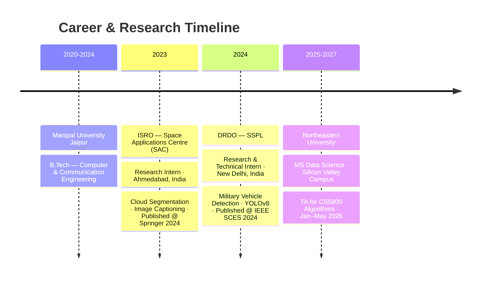

<div align="center">

<!-- Animated Header -->


<!-- Typing Animation -->
[](https://git.io/typing-svg)

<!-- Social Badges -->
<p>
<a href="https://linkedin.com/in/aayush-katoch-a47413175"></a>
<a href="https://github.com/Aayush99000"></a>
<a href="mailto:katoch.aa@northeastern.edu"></a>
<a href="https://leetcode.com/u/aayush99000/"></a>
<a href="https://kaggle.com/aayushkatoch/"></a>
<a href="https://www.tensortonic.com/profile"></a>
</p>


</div>

---

## 🧠 About Me

```python
import torch
import torch.nn as nn
from dataclasses import dataclass, field
from typing import List, Dict

@dataclass
class ResearcherConfig:
    name:       str  = "Aayush Katoch"
    location:   str  = "Fremont, CA 🌉"
    education:  str  = "MS Data Science @ Northeastern University (Silicon Valley)"
    gpa_track:  str  = "Expected Dec 2027"

    # Current roles
    roles: List[str] = field(default_factory=lambda: [
        "Teaching Assistant — CS5800 Algorithms @ NEU",
        "Published Researcher — Satellite AI & Medical Imaging",
    ])

    # Research background
    experience: Dict[str, str] = field(default_factory=lambda: {
        "ISRO (SAC)"  : "Cloud segmentation · Image captioning · 98% acc · BLEU-1 0.8406",
        "DRDO (SSPL)" : "Military vehicle detection · YOLOv8-m · 80.41% mAP · 22% faster inference",
    })

    # Model specializations
    expertise: List[str] = field(default_factory=lambda: [
        "Computer Vision & Segmentation",
        "NLP · LLMs · RAG Pipelines",
        "Medical Imaging under Data Scarcity",
        "Satellite & Geospatial AI",
        "Generative Models & Motion Synthesis",
    ])

    optimizer:   str  = "Curiosity-driven learning 🔍"
    loss_fn:     str  = "Impact on real-world systems"
    convergence: str  = "Deep understanding over surface familiarity"


class AayushKatoch(nn.Module):
    def __init__(self, config: ResearcherConfig):
        super().__init__()
        self.config   = config
        self.backbone = "Research @ ISRO + DRDO"
        self.head     = "MS Data Science @ Northeastern"

    def forward(self, problem: str) -> str:
        features   = self._extract_deep_features(problem)
        solution   = self._reason_and_build(features)
        return f"📦 Portfolio-worthy output: {solution}"

    def _extract_deep_features(self, x): ...
    def _reason_and_build(self, x): ...

    def say_hi(self):
        print("Let's build something that actually ships 🚀")


model = AayushKatoch(ResearcherConfig())
model.say_hi()
# >>> Let's build something that actually ships 🚀
```

---

## 🚀 What I'm Currently Working On

<table>
<tr>
<td width="50%">

### ✈️ TripCraft (NLP Course Project)
AI-powered travel itinerary generator
- Slot filling for intent & entity extraction
- RAG pipeline with **ChromaDB** + **Groq (Llama 3)**
- Streamlit frontend for interactive planning
- End-to-end NLP architecture from scratch

</td>
<td width="50%">

### 🎯 Active Research Interests
- 🛰️ **Satellite AI** — Segmentation, Captioning, GIS
- 🤖 **LLMs & RAG** — ChromaDB, LangChain, Groq
- 🩺 **Medical Imaging** — Low-resource transfer learning
- 🕺 **Motion Generation** — Sign language, SMPL-X, diffusion
- 📚 **Algorithms** — DP, Greedy, Graph Theory (TA)

</td>
</tr>
</table>

---

## 🗺️ My Journey



---

## 🛠️ Tech Arsenal

### 🤖 Deep Learning & Computer Vision


### 🔍 NLP, LLMs & RAG


### 💻 Languages


### 🌐 Backend, Tools & Cloud


---

## 🔬 Featured Projects

<div align="center">
<table>
<tr>
<td width="50%">
<h3 align="center">🛰️ Cloud Detection on Satellite Data</h3>
<p align="center">


</p>
<p>Deep learning segmentation on LANDSAT satellite imagery. Transfer Learning outperformed scratch-trained CNN by 6% Dice score. <strong>Published @ IEEE SCES 2024.</strong></p>
</td>
<td width="50%">
<h3 align="center">🖼️ Satellite Image Captioning</h3>
<p align="center">


</p>
<p>Encoder-decoder benchmarking (VGG-19, ResNet-50, DenseNet-201, EfficientNet-B7 + LSTM) on Sydney & RSICD datasets. Best: EfficientNet-B7 + LSTM. <strong>Published @ Springer ISMS 2023.</strong></p>
</td>
</tr>
<tr>
<td width="50%">
<h3 align="center">🩺 <a href="https://github.com/Aayush99000">Low-Resource Medical Imaging</a></h3>
<p align="center">


</p>
<p>Empirical study under extreme data scarcity (~300 samples) — scratch vs ImageNet vs MedSIGLIP. ImageNet pretraining gave <strong>+14% accuracy</strong> (78% → 92%). AUC: 0.9875.</p>
</td>
<td width="50%">
<h3 align="center">💪 <a href="https://github.com/Aayush99000/RAG-Fitness-Assistant">RAG Fitness Assistant</a></h3>
<p align="center">


</p>
<p>Real-time AI fitness coach — Groq/Llama 3 + ChromaDB + MediaPipe pose estimation. Personalized workout plans with live form feedback via Streamlit.</p>
</td>
</tr>
<tr>
<td width="50%">
<h3 align="center">🕺 Text-to-Sign Motion Generation</h3>
<p align="center">


</p>
<p>Baseline pipeline mapping natural language → realistic sign language motion sequences (T × 668 skeletal features). Modular Text → Gloss → Motion stages with extensibility for diffusion synthesis.</p>
</td>
<td width="50%">
<h3 align="center">🔍 RAG Job Filter Extension</h3>
<p align="center">


</p>
<p>Chrome extension for semantic job filtering using BERT-based embeddings and a Flask backend. RAG-powered relevance scoring against your profile in real time.</p>
</td>
</tr>
</table>
</div>

---

## 📊 GitHub & LeetCode Stats

<div align="center">


<br/>

<a href="https://leetcode.com/u/aayush99000/">

</a>

</div>

---

## 📄 Publications

<div align="center">

| Year | Title | Venue |
|:----:|:------|:------|
| 2024 | **Image Captioning of Satellite Images Using Transfer Learning and LSTM Blending** | Springer — AI Technologies for Information Systems (ISMS 2023), LNNS vol. 1136 |
| 2024 | **Enhancing Cloud Detection Performance: A Comparative Study of CNN Models** | IEEE Students Conference on Engineering and Systems (SCES), Prayagraj |

</div>

---

## 🏆 Impact at a Glance

```
┌──────────────────────────────────────────────────────────────────────────────────┐
│                                                                                  │
│  🛰️  ISRO (SAC)          →  98% accuracy · 93% Dice · BLEU-1 0.8406            │
│  🔬  DRDO (SSPL)         →  80.41% mAP · 22% faster inference · 96.5% cls acc  │
│  🩺  Medical Imaging     →  +14% accuracy · AUC 0.9875 · ~300 sample regime    │
│  📖  Publications        →  IEEE SCES 2024 · Springer LNNS 2024                │
│  📚  CS5800 TA @ NEU     →  Algorithms — DP, Greedy, Graph Theory              │
│  🕺  Motion Generation   →  Text → Sign · 55-joint SMPL-X · 12k samples        │
│                                                                                  │
└──────────────────────────────────────────────────────────────────────────────────┘
```

---

<div align="center">

### 🤝 Let's Connect & Collaborate!

**Open to research collaborations, ML engineering roles, and everything at the intersection of AI + real-world impact.**

<a href="https://linkedin.com/in/aayush-katoch-a47413175">

</a>

<br><br>

<i>"The model only generalizes if you understand the distribution." 📊</i>

</div>

<!-- Footer Wave -->

